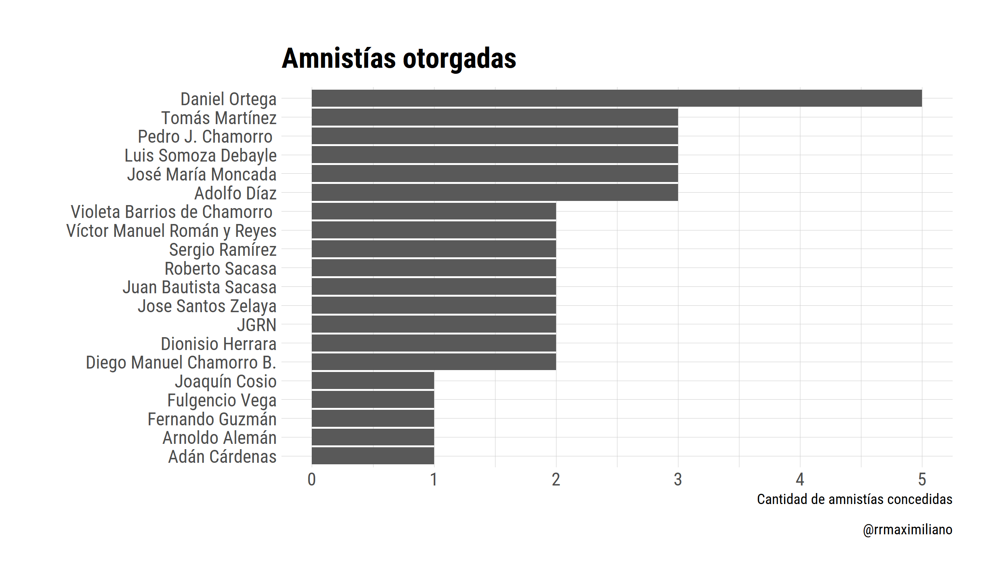
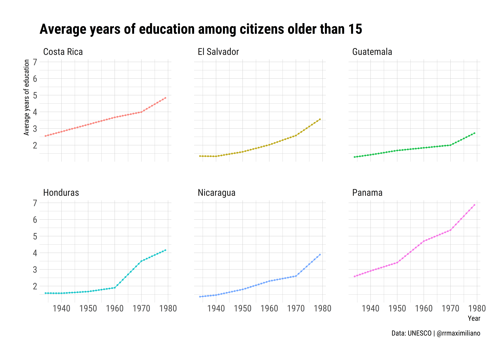
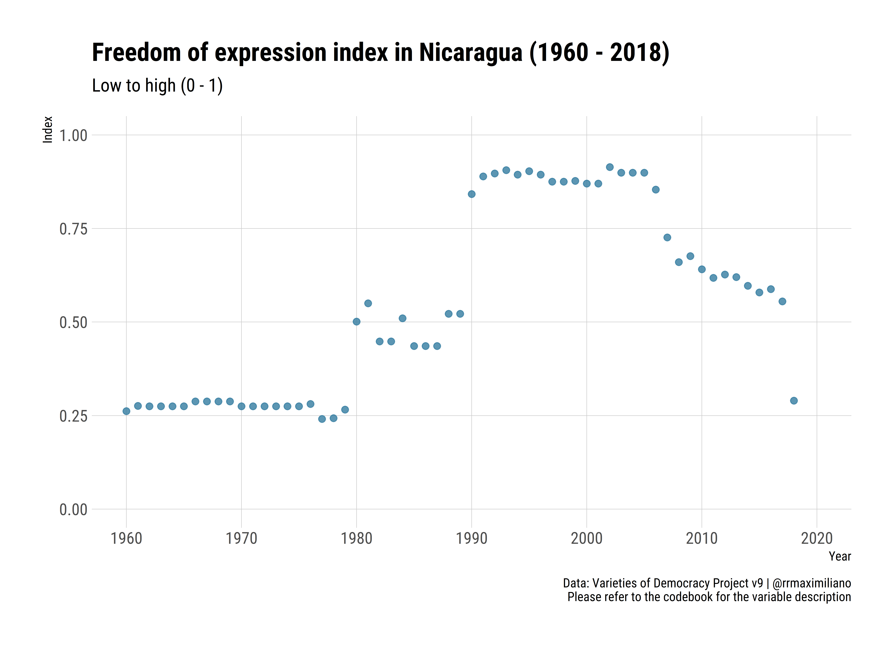
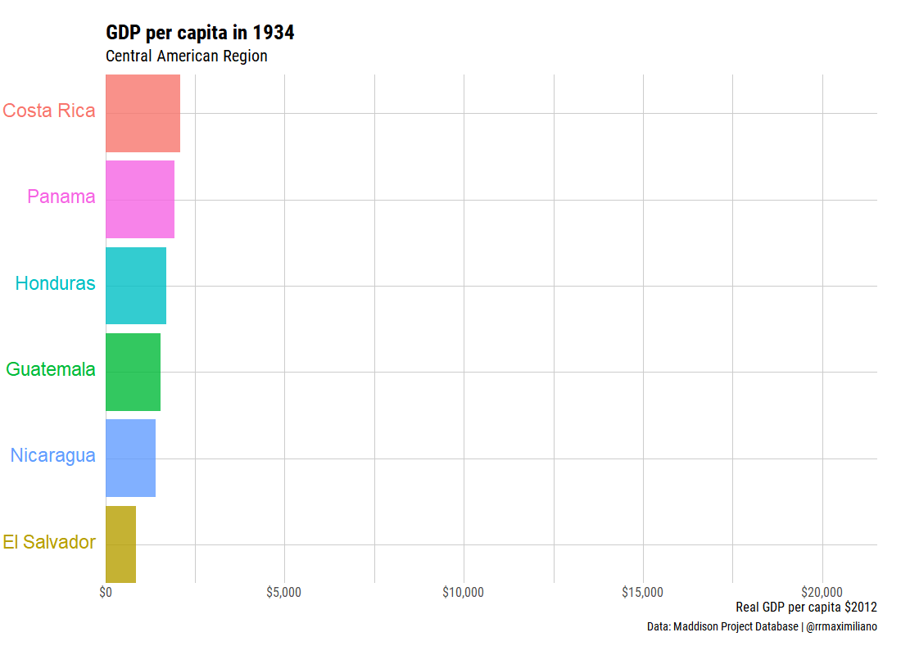
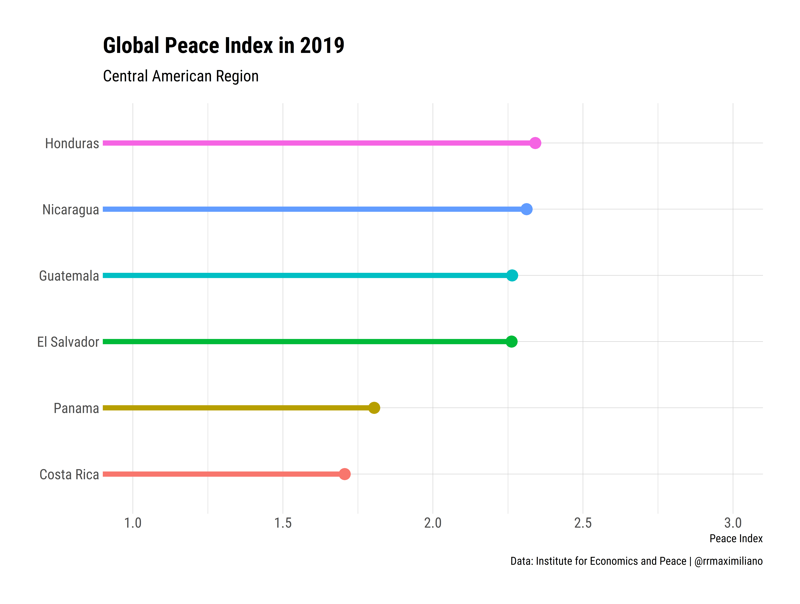
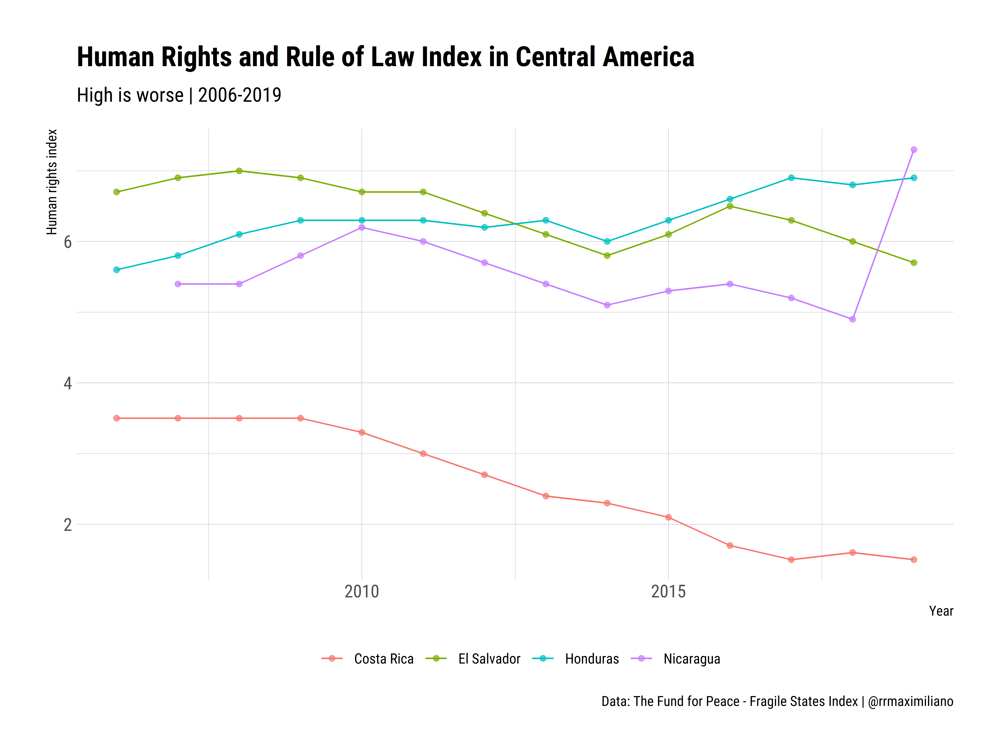
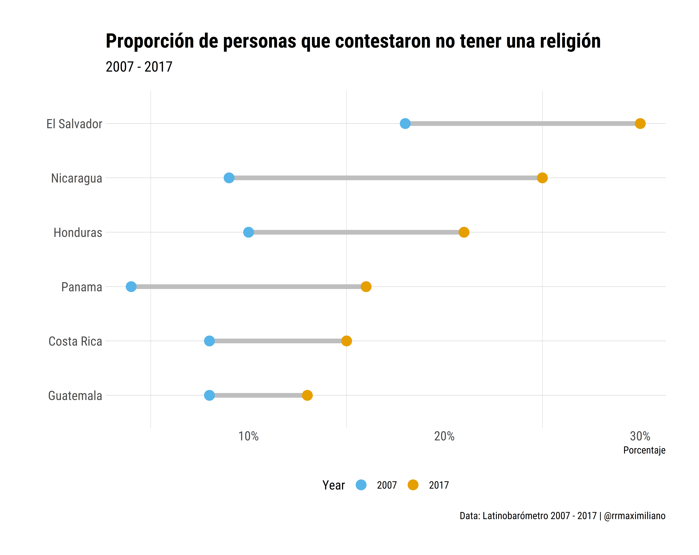
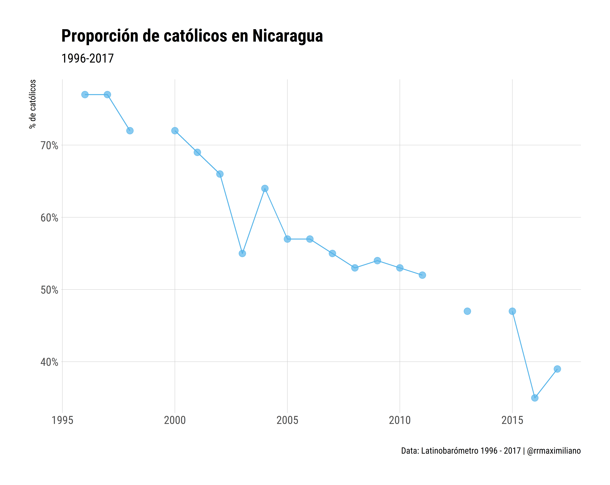
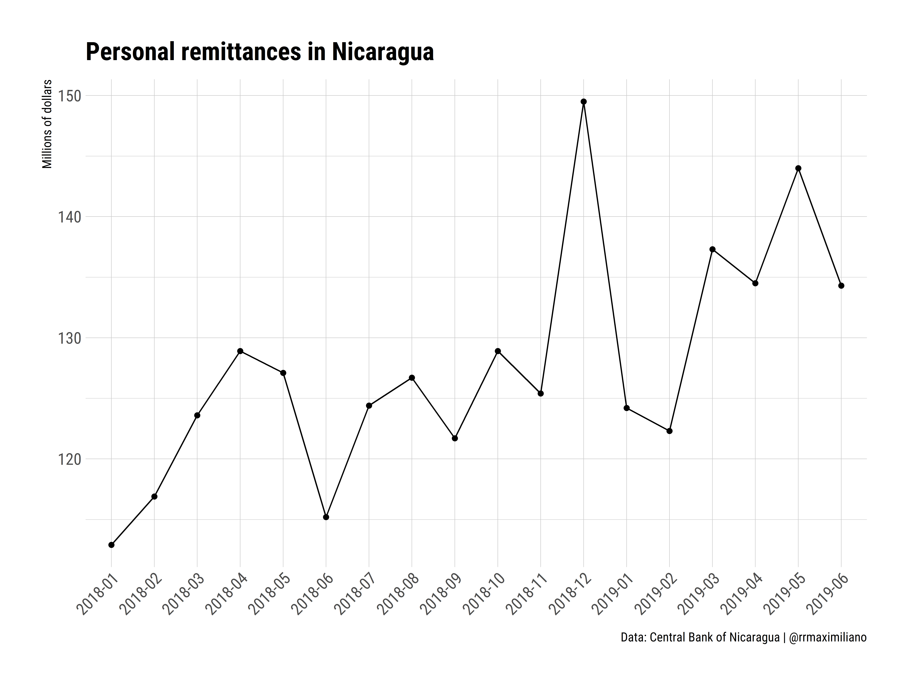
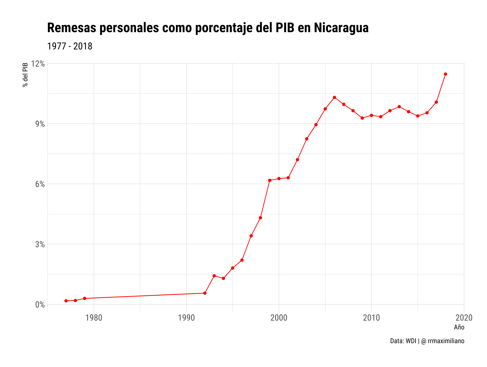

# Data Visualizations: Nicaragua

This repository contains data on socio and economic indicators of the current state of Nicaragua and the Central American region. Please feel free to share it with your friends and colleagues.

In this repository, you will find topic-related folders with the following structure:

* `/Topic I`:
  * `/data`
  * `/figs`
  * `/script`

Topics covered in this repository:

## Air pollution

## Amnesty

## Daniel Ortega's speeches

## Education

## Electoral Democracy Index

## Freedom of Expression

## GDP per capita

## Global Peace Index

## Human Rights and Rule of Law: Fragile States Index

## Internet and fixed telephone subscriptions

## Religion

## Remittances

